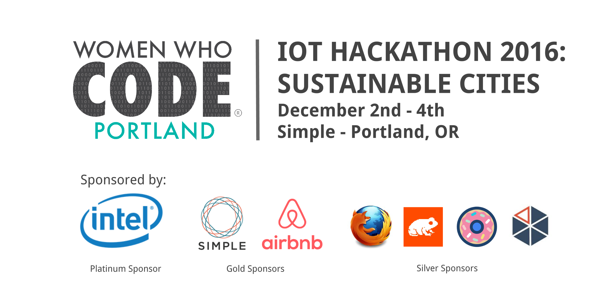
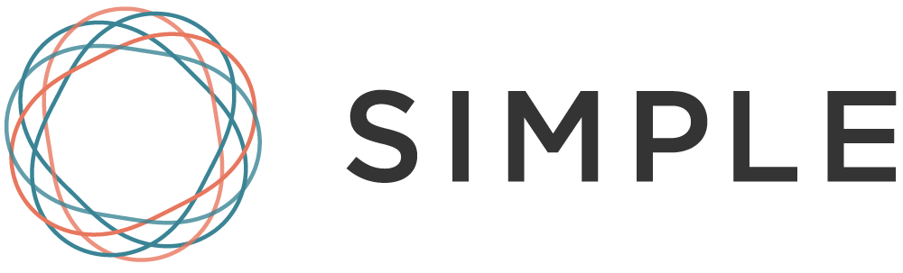
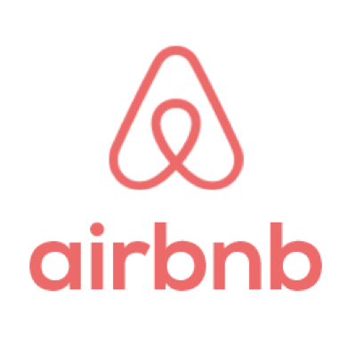
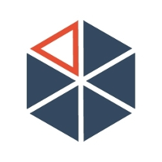
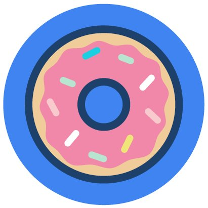
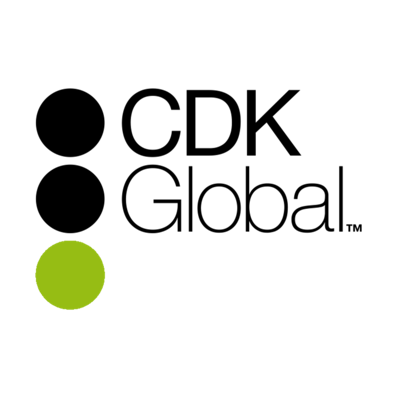

## WWCode Portland - IoT Hackathon 2016

**Tickets:** [get your FREE ticket today](https://www.eventbrite.com/e/iot-hackathon-2016-tickets-28883385985)

### Code of Conduct

Women Who Code (WWCode) is dedicated to providing an empowering experience for everyone who participates in or supports our community, regardless of gender, gender identity and expression, sexual orientation, ability, physical appearance, body size, race, ethnicity, age, religion, or socioeconomic status. Because we value the safety and security of our members and strive to have an inclusive community, we do not tolerate harassment of members or event participants in any form. Our [Code of Conduct](https://github.com/WomenWhoCode/guidelines-resources/blob/master/code_of_conduct.md) applies to all events run by Women Who Code, Inc. If you would like to report an incident or contact our leadership team, please submit an [incident report form](https://docs.google.com/forms/d/e/1FAIpQLScmJq0Evb0aDbx4flmmZT1xX0GCXj_F--5asjfH7XvkrLo4xA/viewform).

### Prepping for the Hackathon
- Webinar: Monday, Nov. 21 at 7pm - led by Intel 
- Workshop: Saturday, Dec. 3rd, 9:30-11:00 AM - led by Intel 
- Online course from Pluralsight: [Node.js and the Internet of Things Using Intel Edison](https://www.pluralsight.com/courses/nodejs-internet-of-things-intel-edison) 

##### More About the Hardware
- [Intel Edison Compute Module](https://software.intel.com/en-us/iot/hardware/edison) 
- [Intel IoT Developer Kit](https://software.intel.com/en-us/iot/hardware/dev-kit) 
- [Grove Starter Kit](https://software.intel.com/en-us/blogs/2015/05/29/grove-starter-kit-with-intel-galileo-gen-2-getting-started-0)

##### Some Ideas
- The [Internet of Buckets](https://twitter.com/oshpark/status/784476729536487424) installation
- [5 promising examples of IoT and wearable devices that enable people with disabilities](https://medium.com/@imn/5-promising-examples-of-iot-and-wearable-devices-that-enable-people-with-disabilities-f50df601e046#.wbf3s2d5e)
- [Prototyping a Piggy Bank](https://blog.prototypr.io/prototyping-a-connected-piggy-bank-1d4e507a9a77#.a0u5vxeaa)
- NASA and the [Internet of Pumpkins](https://twitter.com/YazzieSays/status/791734536581156864)

### Schedule
##### Friday, December 2nd
- 5:30 - Doors Open + Dinner
- 6:30 - Official Welcome + IoT Lightning Talks
- 8:30 - Pitch Ideas + Team Forming
- 10:00 - Go Home and Rest

##### Saturday, December 3rd
- 9:00 - Doors Open + Coffee + Bagels
- 9:30 - Workshop on Intel Edison - Led by Grace Metri, Intel IoT Evangelist
- 11:00 - Hack
- 12:30 - Lunch
- 7:00 - Dinner
- 10:00 - Go Home and Rest

##### Sunday, December 4th
- 9:00 - Doors Open + Coffee + Bagels
- 12:00 - Lunch
- 1:00 - Submissions Due + Presentations Begin
- 2:30 - Winners Announced 
- 3:00 - Closing Remarks

### Thank you to our Sponsors!

##### Platinum Sponsor

##### Gold Sponsors

##### Silver Sponsors

##### Bronze Sponsors

